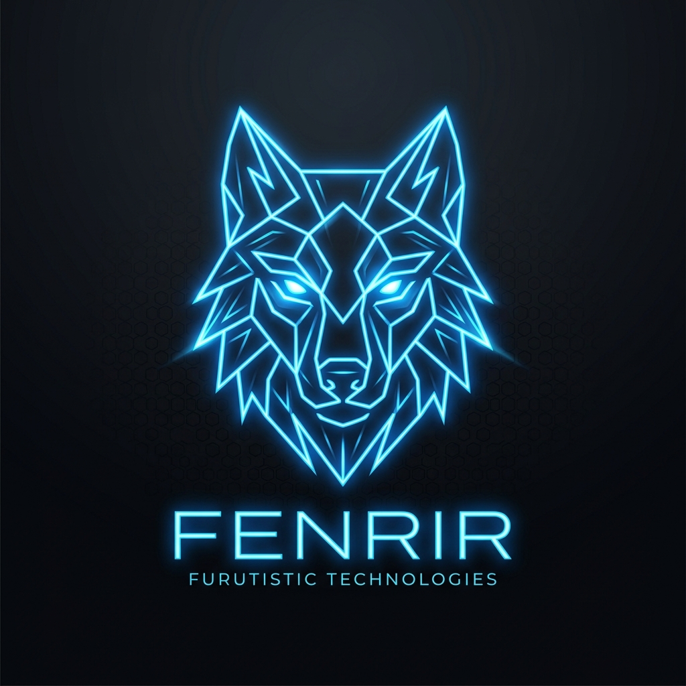

<p align="center">
  
</p>

# Fenrir Web Framework

[](https://opensource.org/licenses/MIT)
[](https://www.python.org/)
[]()
[]()

**Fenrir** is a state-of-the-art, high-performance, hybrid Python web framework built on top of modern ASGI specifications. It elegantly merges the best programming paradigms from Python's most popular web frameworks (**Flask**, **FastAPI**, **Sanic**, **Falcon**, and **Bottle**) into a single unified workspace, powered locally by the premium **Asteri v2.2.2** application server.

Whether you prefer the automatic Pydantic validation of FastAPI, the seamless context-locals of Flask, the raw class-based speed of Falcon, or the robust background task model of Sanic, **Fenrir** allows you to leverage them all simultaneously in the same codebase.

---

## 🌟 Key Features

*   **⚡ High-Speed ASGI Core**: Extremely low-overhead routing and handler pipeline, achieving massive request throughput.
*   **🧩 Framework Hybridization**:
    *   **FastAPI Paradigm**: Native Pydantic v2 data validation, `Annotated` type decorators, automated parameter resolution (`Query`, `Path`, `Header`, `Cookie`, `Body`), dynamic dependency injection (`Depends`), and automated `response_model` serialization.
    *   **Flask Paradigm**: Thread/Task-safe context locals (`request`, `g`, `session`), Jinja2 template rendering (`render_template`), and request teardown hooks.
    *   **Falcon Paradigm**: Class-based resource controllers (`on_get`, `on_post`), before/after hooks, and in-place response mutation.
    *   **Sanic Paradigm**: Global `sys.modules` patching (`install_sanic_compat()`), standard response helpers (`json`, `text`, `html`, `raw`, `redirect`), lifecycle listeners (`before_server_start`, etc.), and a background event scheduler (`app.add_task`).
    *   **Bottle Paradigm**: Built-in WSGI-to-ASGI wrapper and legacy mount adapter (`app.mount_wsgi()`) to run old WSGI applications at ASGI speeds.
*   **📖 Auto-Generated OpenAPI Docs**: Interactive **Swagger UI** (`/docs`) and **ReDoc** (`/redoc`) instantly generated from your Pydantic schemas and route metadata.
*   **🔌 Modern Communications**: Out-of-the-box support for **WebSockets** and **Server-Sent Events (SSE)**.
*   **🛠️ Premium CLI Tooling**: Visual route tables, interactive app shell, in-memory benchmarking suite, project scaffolding, and environment system inspection.

---

## 📦 Installation

To install Fenrir in development mode, clone the repository and run:

```bash
pip install -e .
```

To install all optimal development and testing dependencies:

```bash
pip install pytest httpx watchdog pydantic jinja2 asteri>=2.2.2
```

---

## 🚀 Quick Start (The Hybrid Power)

Here is a simple example (`demo_app.py`) showcasing how Flask, FastAPI, Falcon, and Sanic styles coexist harmoniously in a single application:

```python
import logging
from pydantic import BaseModel
from fenrir import (
    Fenrir, Blueprint, request, g, Depends, Query, Header,
    render_template, Response, Form, File, UploadFile,
    WebSocket, WebSocketDisconnect
)

logging.basicConfig(level=logging.INFO)
logger = logging.getLogger("demo")

# Initialize the Hybrid App
app = Fenrir(title="Fenrir Hybrid Demo", version="1.0.0")

# --- 1. FastAPI-Style Validation & DI ---
class UserRegister(BaseModel):
    username: str
    email: str
    age: int

async def verify_api_key(x_api_key: str = Header(default=None)):
    if x_api_key != "super-secret-key":
        logger.warning("Invalid API key attempt")
    return x_api_key

# --- 2. Flask-Style Routing & Context-Locals ---
@app.get("/")
async def home():
    name = request.args.get("name", "Fenrir Developer")
    return render_template("index.html", name=name)

# --- 3. Falcon-Style Class-Based Resources ---
class ItemResource:
    async def on_get(self, req, resp, item_id: int):
        resp.status = 200
        resp.media = {"item_id": item_id, "style": "Falcon Resource"}

app.add_route("/items/<item_id:int>", ItemResource())

# --- 4. Sanic-Style Listeners & Background Tasks ---
@app.listener("before_server_start")
async def setup_db(app_instance):
    logger.info("Initializing mock database...")

@app.middleware("request")
async def log_request(req):
    logger.info(f"Incoming: {req.method} {req.path}")
    g.user_role = "guest"  # Share state using Flask-style 'g'

# Run with Asteri ASGI server
if __name__ == "__main__":
    app.run(host="127.0.0.1", port=8000, workers=2)
```

---

## 💻 CLI Command Reference

Fenrir comes packed with a high-fidelity, visually rich command-line tool. Start the CLI by executing `fenrir` or `python -m fenrir.cli`.

### 1. `fenrir run`
Serve your application locally. Powered by **Asteri v2.2.2**, supporting dynamic multiprocessing, worker management, and live hot-reloading.
```bash
fenrir run demo_app:app --port 8000 --dev
```
*   **Flags**:
    *   `-H`, `--host`: Host bind address (default: `127.0.0.1`).
    *   `-p`, `--port`: Port number (default: `8000`).
    *   `-w`, `--workers`: Number of concurrent workers (default: `1`).
    *   `-d`, `--dev` / `--reload`: Active development mode with auto-reload.

### 2. `fenrir routes`
Print a beautiful, colorized structural table of all registered HTTP endpoints, methods, matching handlers, and associated blueprints.
```bash
fenrir routes demo_app:app
```
**Output Example:**
```text
----------------------------------------------------------------
Path                  Methods        Handler           Blueprint
----------------------------------------------------------------
/openapi.json         GET, OPTIONS   openapi_endpoint  -        
/docs                 GET, OPTIONS   swagger_ui        -        
/                     GET, OPTIONS   home              -        
/items/<item_id:int>  GET, POST      ItemResource      -        
/api/register         OPTIONS, POST  register_user     api      
/ws/chat              WEBSOCKET      chat_ws           -        
----------------------------------------------------------------
```

### 3. `fenrir shell`
Instantly spawn an interactive python shell pre-configured with all key framework classes and context loaded (`app`, `request`, `g`, `Response`, `Blueprint`, etc.).
```bash
fenrir shell demo_app:app
```

### 4. `fenrir bench`
Perform in-memory framework benchmarking directly over ASGI using `HTTPX`. Eliminates network noise and tests raw pipeline speed under loaded constraints.
```bash
fenrir bench demo_app:app -i 1000 -t 5 -p / -m GET
```

### 5. `fenrir new`
Scaffold a complete, cleanly structured template of a new Fenrir project directory in seconds.
```bash
fenrir new my_new_project
```

### 6. `fenrir info`
Inspect the environment including Python details, OS details, Pydantic/Asteri versions, active compatibility layers, and route statistics.
```bash
fenrir info demo_app:app
```

---

## 🧪 Comprehensive Test Suite

Fenrir is thoroughly covered by an automated test suite comprising **478 tests** validating every single component, compat namespace, file upload, routing detail, and CLI functionality.

Run the test suite using `pytest`:

```bash
pytest -v
```

### Output:
```text
======================== 477 passed, 1 skipped in 3.48s ========================
```

---

## 🛠️ Package Distribution (PyPI Publish Ready)

Fenrir is packed and ready for distribution.
1. Build the distribution binaries:
   ```bash
   python -m build
   ```
2. Upload to PyPI using twine:
   ```bash
   python -m twine upload dist/*
   ```

---

## 📜 License

Fenrir is open-sourced software licensed under the [MIT License](LICENSE).
